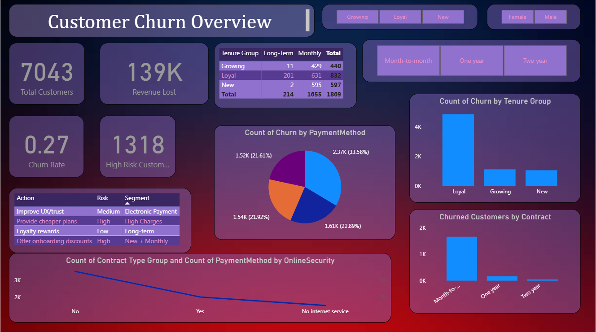

# 📊 Customer Churn Dashboard (Power BI)

## 📌 Problem Statement
Telecom companies face significant customer churn, leading to revenue loss. This project analyzes customer behavior to identify churn patterns and recommend retention strategies.

---

## 📁 Dataset
- IBM Telco Customer Churn Dataset
- 7,000+ customer records

---

## 🛠 Tools Used
- Power BI
- DAX (Data Analysis Expressions)
- Data Cleaning & Transformation

---

## 📊 Key Metrics
- Total Customers
- Churn Rate
- Revenue Lost
- High-Risk Customers

---

## 🔍 Key Insights
- 38% of churned customers are on month-to-month contracts
- New customers (≤ 3 months) have the highest churn rate
- High monthly charges strongly increase churn probability
- Electronic check payment users show higher churn

---

## 💡 Business Recommendations
- Offer onboarding discounts for new customers
- Provide flexible pricing plans for high-charge users
- Improve payment experience for electronic users
- Reward long-term customers with loyalty benefits

---

## 📸 Dashboard Preview

---

## 🔗 Project Link
https://github.com/yourusername/customer-churn-dashboard
